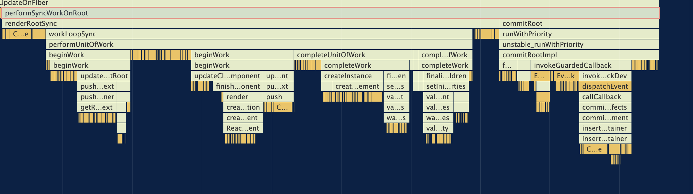

## updateContainer

ReactDOM.render 方法里会执行 legacyRenderSubtreeIntoContainer 方法，第一次渲染的时候还没有创建 FiberRootNode，legacyRenderSubtreeIntoContainer 里会判断 `if(!root)`  来创建 FiberRootNode 和根节点的 rootFiber，创建完成后会执行 updateContainer，里面包含 render 阶段和 commit 阶段

```js
// react-dom/src/client/ReactDOMLegacy.js
function legacyRenderSubtreeIntoContainer(
  parentComponent: ?React$Component<any, any>,
  children: ReactNodeList,
  container: Container,
  forceHydrate: boolean,
  callback: ?Function,
) {
  let root: RootType = (container._reactRootContainer: any);
  let fiberRoot;
    // 首次渲染页面还没有挂载任何DOM，所以 root 是 null
  if (!root) {
    // Initial mount
    // mount 阶段
    // 创建了 FiberRootNode (root._internalRoot)
    root = container._reactRootContainer = legacyCreateRootFromDOMContainer(
      container,
      forceHydrate,
    );
    console.log(root._internalRoot, 'root22')
    // fiberRoot = FiberRootNode,
    // 因为 legacyCreateRootFromDOMContainer 返回的是 ReactDOMBlockingRoot 对象，他的 this._internalRoot 是创建好的 FiberRootNode
    fiberRoot = root._internalRoot;
    if (typeof callback === 'function') {
      const originalCallback = callback;
      callback = function() {
        const instance = getPublicRootInstance(fiberRoot);
        originalCallback.call(instance);
      };
    }
    // Initial mount should not be batched.
    // unbatchedUpdates 不需要批处理
    unbatchedUpdates(() => {
      // updateContainer(children: ReactElement, container: FIberRootNode) 
      updateContainer(children, fiberRoot, parentComponent, callback);
    });
  }
  }
```

updateContainer 的参数分别是：ReactElement（JSX），创建好的 FiberRootNode（整个应用的根节点），parentComponent（render 时传的是 null）,callback（ReactDOM.render 的第三个参数），这里我们主要看前两个参数 JSX 和 FiberRootNode。

在 updateContainer 里主要做了以下事情：

1. `const current = rootFiber(FiberRootNode.current)` React 的 FiberRootNode 使用 current 属性指向 rootFiber，也就是 render App 的根 fiber 节点
2. `const eventTime = requestEventTime()` 声明了开始时间，用于在 scheduler 里做任务的优先级处理
3. `const update = createUpdate(eventTime, lane)` 创建 update 对象用于 React 的状态更新
4. `update.payload = {element}` 把传入的 JSX 赋值给 update.payload, 后面也是用于更新
5. `enqueueUpdate(current, update)` 初次 render 的时候让创建的 update 和自己形成环状链表
6. `scheduleUpdateOnFiber(current, lane, eventTime);` 执行下一步操作

```js
// react-reconciler/src/ReactFiberReconciler.old.js
export function updateContainer(
  element: ReactNodeList,
  container: OpaqueRoot,
  parentComponent: ?React$Component<any, any>,
  callback: ?Function,
): Lane {
  const current = container.current;
  const eventTime = requestEventTime();
  const lane = requestUpdateLane(current);
  const update = createUpdate(eventTime, lane);
  update.payload = {element};
  enqueueUpdate(current, update);
  
  scheduleUpdateOnFiber(current, lane, eventTime);

  return lane;
}
```

## scheduleUpdateOnFiber 判断 React 任务的优先级是否同步

updateContainer 之后执行了 scheduleUpdateOnFiber，里面判断了 React 任务是同步还是异步做了不同的处理，最后执行 performSyncWorkOnRoot 。第一次 render 的时候我们只看同步任务，关于异步的以后再了解。

```js
// react-reconciler/src/ReactFiberWorkLoop.old.js
export function scheduleUpdateOnFiber(
  fiber: Fiber,
  lane: Lane,
  eventTime: number,
) {
  ...
    if (lane === SyncLane) {
      if (
        // Check if we're inside unbatchedUpdates
        // unbatchedUpdates 不需要批处理 
        (executionContext & LegacyUnbatchedContext) !== NoContext &&
        // Check if we're not already rendering
        // 判断还没有渲染的话
        (executionContext & (RenderContext | CommitContext)) === NoContext
      ) {
        // Register pending interactions on the root to avoid losing traced interaction data.
        // 在根目录上注册挂起的交互，以避免丢失跟踪的交互数据。
        // 第一次渲染的时候先不管
        schedulePendingInteractions(root, lane);

        // This is a legacy edge case. The initial mount of a ReactDOM.render-ed
        // root inside of batchedUpdates should be synchronous, but layout updates
        // should be deferred until the end of the batch.

        // !react render + commit 阶段总入口
        // https://react.iamkasong.com/process/reconciler.html#%E9%80%92-%E9%98%B6%E6%AE%B5
        performSyncWorkOnRoot(root);
      }
     ...
    }
}
```

我们这里只关注第一次 render 的流程，其他的东西我们暂时不管，然后我们进入到 performSyncWorkOnRoot 里把 render 流程继续走下去。

## performSyncWorkOnRoot 里的 render 阶段和 commit 阶段

performSyncWorkOnRoot 是一个比较重要的函数，可以说是 React 最后流程的总函数，从下面的调用栈中可以看出，这个函数里完成了 render 阶段和 commit 阶段（renderRootSync 和 commitRoot）

在 renderRootSync 函数里会开始向下进行 `深度优先遍历` ，为遍历到的每个 Fiber 节点调用 beginWork 方法，也就是 beginWork 阶段，当遍历到叶子节点时会执行 completeWork 方法，当某个 Fiber 节点执行完 completeWork，如果其兄弟 FIber 节点存在的话 （`fiber.sibling !== null`）会进入其兄弟 Fiber 节点的 beginWork 阶段，如果不存在，则会向上进入父级 Fiber 的 completeWork，直到 rootFiber 节点，至此 render 阶段的工作就结束了。




```js
// react-reconciler/src/ReactFiberWorkLoop.old.js
function performSyncWorkOnRoot(root) {
  let lanes;
  let exitStatus;
  
  if (
    root === workInProgressRoot &&
    includesSomeLane(root.expiredLanes, workInProgressRootRenderLanes)
  ) {
    ...
  } else {
    // 第一次 render 进入到这里
    lanes = getNextLanes(root, NoLanes);
    exitStatus = renderRootSync(root, lanes);
  }
  
}
```

